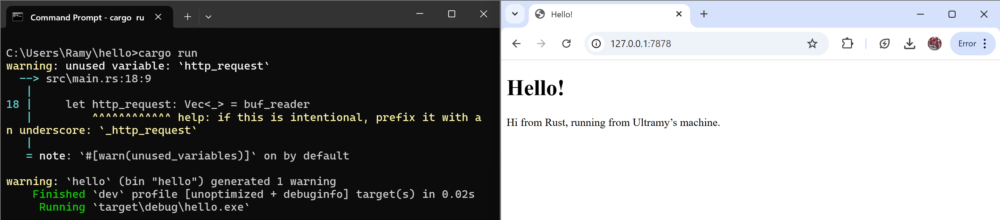

## Commit 1 Reflection Notes
Kita membuat fungs handle_connection. Fungsi ini bertugas untuk memproses koneksi yang diterima. Ketika ada koneksi, data dari klien dibaca menggunakan BufReader. Setiap baris yang diterima kemudian dikumpulkan untuk membentuk permintaan HTTP. Setelah permintaan selesai dibaca, server dapat memeriksa isi permintaan untuk menentukan respons yang sesuai. Fungsi ini memastikan bahwa server dapat memproses permintaan dengan benar dan memberikan respons yang tepat. Proses ini memungkinkan server untuk merespons berbagai jenis permintaan yang diterima dari klien

## Commit 2 Reflection Notes
Fungsi handle_connection membaca permintaan HTTP. Kemudian, server memuat file hello.html yang telah kita buat. File ini berisi pesan untuk dikirimkan sebagai respons. Respons kemudian dibangun dalam format HTTP. Respons ini dikirimkan kembali ke klien melalui koneksi TCP. Dengan demikian, server dapat mengirimkan halaman HTML.

## Commit 3 Reflection Notes
Kita menambahkan kondisi pada fungsi handle_connection. Kondisi baru ini terletak pada nagian else{}. Bagian tersebut berfungsi untuk menangani kondisi saat sebuah halaman tidak ditemukan. Jika halaman tidak ditemukan, kita akan menampilkan halaman html yang sesuai. Halaman tersebut adalah halaman HTML yang kita simpan sebagai 404.html pada direktori projek. Halaman ini berguna untuk menampilkan pesan eror yang sesuai.

## Commit 4 Reflection Notes
Kita ingin mencoba mensimulasikan respon yang lambat. Kita menggunakan sleep. Sleep akan terpanggil ketika kita memanggil endpoint /sleep. Jika kita mengakses endpoint tersebut, kita akan menunggu selama waktu yang ditentukan sebelum menerima pesan dari hello.html yang ada pada commit 2. Untuk melakukan hal ini, kita menggunakan funsgi threat::sleep. Fungsi ini dapat diimpor pada std paling atas. Fungsi ini berguna untuk menambahkan delay sesuai durasi yang kita inginkan.